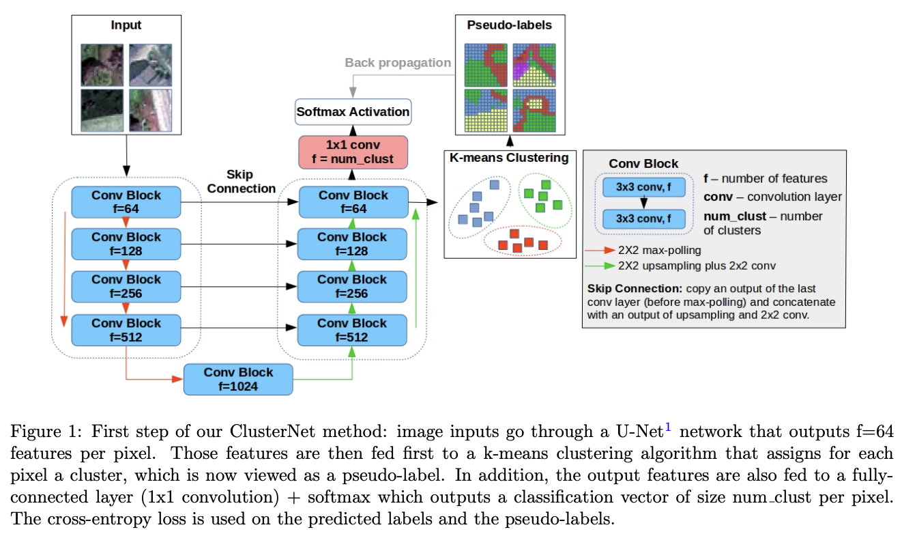
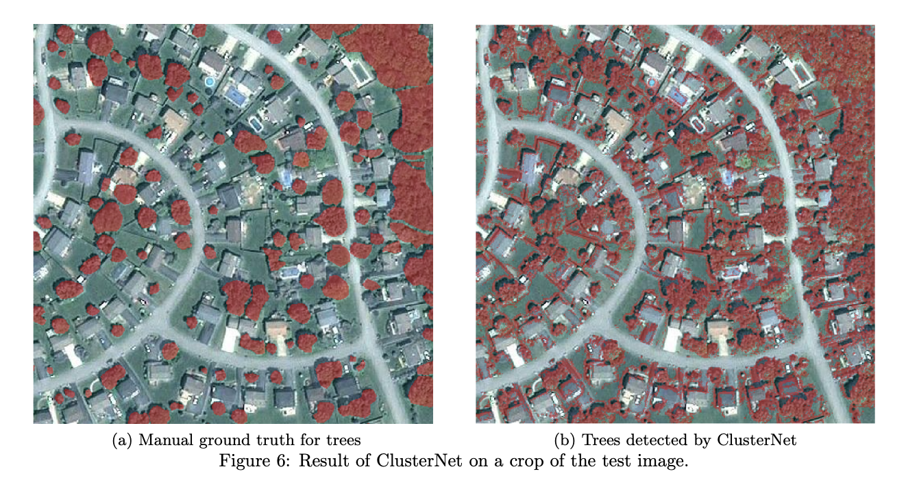

# ClusterNet: Unsupervised Satellite Image Segmentation

[](https://www.python.org/downloads/)
[](https://keras.io/)
[](LICENSE)

Implementation of [**ClusterNet: Unsupervised Generic Feature Learning for Fast Interactive Satellite Image Segmentation**](https://inria.hal.science/hal-02394369v1) (SPIE 2019).

> **Authors:** Nicolas Girard, Andrii Zhygallo, Yuliya Tarabalka
>
> **Abstract:** We present a segmentation approach based on applying K-Means clustering to the high-dimensional feature output of a U-Net encoder-decoder. The method is generic — it can be applied to any image and any class of objects — and requires no ground-truth labels during training.

## Architecture

<p align="center">
  
</p>

A U-Net produces dense per-pixel feature vectors. These features are clustered with K-Means (via FAISS) to generate pseudo-labels, which are then used to re-train the network. This loop iterates until convergence, yielding semantically meaningful segments without any manual annotations.

## Results

<p align="center">
  
</p>

Example of tree crown detection on aerial imagery: ground truth (left) vs. ClusterNet output (right).

## Project Structure

```
clusternet_segmentation/
├── main.py                          # Main unsupervised training loop (U-Net + K-Means)
├── super_train.py                   # Supervised training with context encoder
├── models/
│   ├── UNetValid.py                 # U-Net with valid padding (primary model)
│   ├── ContextEncoder.py            # U-Net with context encoder branch
│   └── VGG_UNet.py                  # U-Net with VGG16 pretrained encoder
├── tools/
│   ├── patch_generator.py           # Generate fixed-size patches from large images
│   ├── clusters2classes.py          # Map cluster IDs to semantic classes using GT
│   ├── evaluation.py                # Dice, accuracy, IoU evaluation metrics
│   ├── full_prediction.py           # Predict on full-size images with geo-referencing
│   └── rasterization.py             # Rasterize shapefiles to masks
├── utils/
│   └── clustering.py                # FAISS-based K-Means (adapted from DeepCluster)
├── interactive_tool/
│   ├── inter_cluster.py             # Tkinter GUI for interactive cluster refinement
│   ├── crop_img.py                  # Crop image patches
│   └── clusters_to_class.py         # Assign clusters to classes from user annotations
├── Dockerfile
└── requirements.txt
```

## Getting Started

### Prerequisites

- Python 3.6+
- TensorFlow 1.x / Keras 2.2
- FAISS (CPU or GPU)

### Installation

```bash
# Clone the repository
git clone https://github.com/zhygallo/clusternet_segmentation.git
cd clusternet_segmentation

# Install Python dependencies
pip install -r requirements.txt

# Install FAISS (recommended via conda)
conda install -c pytorch faiss-cpu    # CPU version
# or
conda install -c pytorch faiss-gpu    # GPU version
```

> **Note:** FAISS is not available via pip. Install it through conda or build from source. See the [FAISS installation guide](https://github.com/facebookresearch/faiss/blob/main/INSTALL.md).

## Usage

### 1. Generate patches from large images

```bash
python tools/patch_generator.py <input_data_path> \
    --output_folder <output_patches_path> \
    --patch_shape 512 512 \
    --stride 512 512
```

### 2. Train the model (unsupervised)

```bash
python main.py <input_patches_path> \
    --num_clusters 100 \
    --num_epochs 100 \
    --learn_rate 1e-4 \
    --out_pred_masks_test <output_path>
```

> **Note:** Uses Keras `ImageDataGenerator`, which requires images to be stored one subfolder level deeper than `<input_patches_path>`.

### 3. Evaluate results

```bash
python tools/evaluation.py \
    --image_path <test_image> \
    --model_weights <path_to_weights> \
    --gt_mask_path <ground_truth_mask> \
    --num_clust 100
```

## How It Works

1. **Feature extraction** — A U-Net encoder-decoder produces a high-dimensional feature map for each input patch.
2. **Clustering** — Per-pixel features are clustered using FAISS K-Means into *K* groups.
3. **Pseudo-label generation** — Cluster assignments become pixel-wise training labels.
4. **Re-training** — The network is re-trained on these pseudo-labels with cross-entropy loss.
5. **Iteration** — Steps 1-4 repeat each epoch; clusters become progressively more semantically coherent.
6. **Post-processing** — A small amount of labeled data can optionally map cluster IDs to object classes (see `tools/clusters2classes.py`).

## Citation

```bibtex
@inproceedings{girard2019clusternet,
  title={ClusterNet: unsupervised generic feature learning for fast interactive satellite image segmentation},
  author={Girard, Nicolas and Zhygallo, Andrii and Tarabalka, Yuliya},
  booktitle={Image and Signal Processing for Remote Sensing XXV},
  volume={11155},
  pages={111550E},
  year={2019},
  organization={International Society for Optics and Photonics}
}
```

## Acknowledgments

- [DeepCluster](https://github.com/facebookresearch/deepcluster) — Facebook Research (clustering approach inspiration)
- [FAISS](https://github.com/facebookresearch/faiss) — Facebook AI Similarity Search (efficient K-Means)
- [U-Net](https://arxiv.org/abs/1505.04597) — Ronneberger et al. (segmentation architecture)

## License

This project is licensed under the MIT License — see the [LICENSE](LICENSE) file for details.
